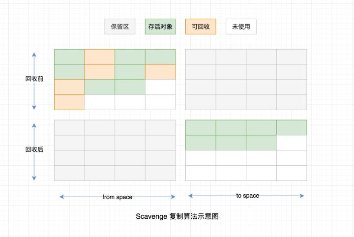
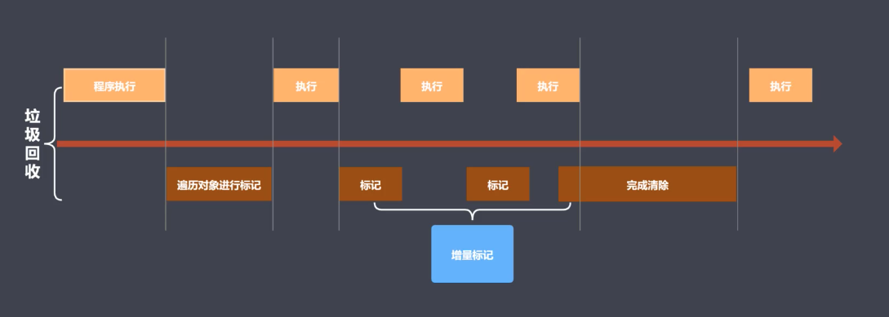

# 左政 ｜ Part 1 | 模块二 | JavaScript 深度剖析-函数式编程、性能与优化作业

## 简答题

### 第一题 描述引用计数的工作原理和优缺点

原理
- 内部通过引用计数器来记录引用数，然后判断当前引用数是否为零是否为垃圾对象
- 引用数：当对象的引用关系发生改变时，引用数发生变化；
  - 例如变量 a 指向一个对象引用，然后执行赋值语句 let b = a; 此时该引用数加 1，如果将 a = null，则引用数减 1；
- 引用数为零时，GC 将立即工作去回收释放该引用对象空间

优点
- 发现垃圾时立即执行回收
- 最大限度减少程序暂停
  - 正常情况下，当我们内存使用完毕时，程序需要等待 GC 回收，从而迫使程序暂停执行（GC 阻塞代码执行）。引用计数可以提前在内存即将爆满时执行垃圾回收，释放引用数为 0 的空间，从而在一定程度上减少程序执行的暂停

缺点
- 无法回收循环引用的对象
  - 循环引用： 对象之间的相互引用
- 时间开销大；
  - 原因：需要维护引用计数器，时刻监听引用数值的变化，增加了时间开销；

### 第二题 描述标记整理算法的工作流程

标记整理算法是标记清除原理的增强

标记清除原理
- 标记阶段：遍历所有对象找到并标记活动对象（可达对象：从全局作用域出发，通过对象引用或者作用域链可以被找到）
- 清除阶段：遍历所有对象，清除没有标记的对象，同时抹除先前的标记

标记清除有个明显的缺点，因为清除的垃圾在空间上的不连续导致，清除的空间不具有连续性，无法为后续程序申请连续性空间；

而标记整理算法增强了整理的能力

标记整理算法原理
- 标记阶段：遍历所有对象找到并标记活动对象
- 整理清除：在执行清除之前，将碎片化空间进行整理，从而清除出连续的空闲空间供程序后续使用

### 第三题 描述 V8 中新生代存储区垃圾回收流程

新生代存储区垃圾回收采用了复制算法和标记整理

- 新生代内存区分为两个等大小空间（From、To）
- 程序正常使用 From 空间，To 空间空闲
- 活动对象存储于 From 空间
- GC 执行时，首先通过标记整理算法对 From 空间执行活动对象标记和整理，然后将标记的活动对象拷贝到 To 空间
- 对空间 From 执行回收操作，完全释放 From 空间即可
- 交换 From 和 To 空间

注意：拷贝过程中可能出现晋升，即将新生代对象移动至老生代；

晋升遵循两个原则

- 一轮 GC 后还存活的新生代
- To 空间的使用率超过新生代空间 25%（25%是官方给的一个值，为了后续  To 变成 From 后，程序还有足够的空间使用）

### 第四题 描述增量标记算法在何时使用，以及工作原理

何时使用

- 老年代进行垃圾回收时

原理：如图，程序执行和垃圾回收是交替执行的，增量标记，指在遍历对象进行标记不是一次性完成，还是分为多次，并和程序代码的执行进行交叉，好处是把耗时的遍历标记全部对象的时间拆解成多块，且因为这些片段阻塞代码执行时间非常短，达到优化的目的

## 代码题 1

### 练习 1

- code/01-01.js

### 练习2

- code/01-02.js

### 练习3

- code/01-03.js

### 练习4

- code/01-04.js

## 代码题 2

### 练习 1

- code/02-01.js

### 练习2

- code/02-02.js

### 练习3

- code/02-03.js

### 练习4

- code/02-04.js

