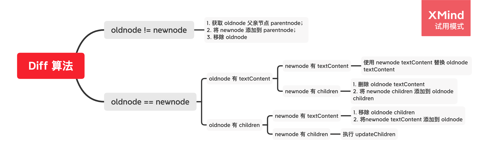
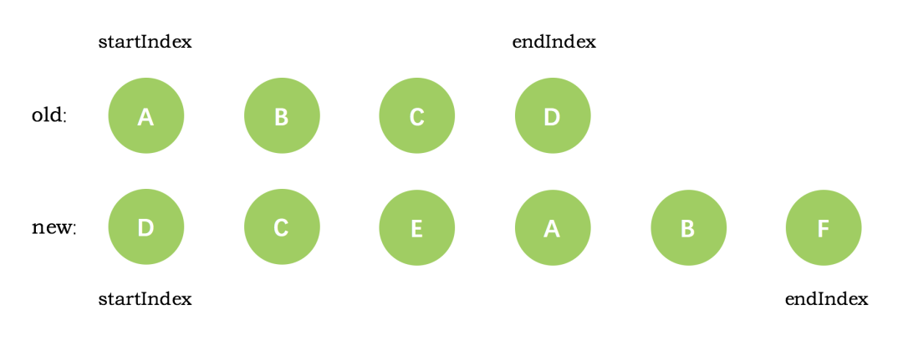

# 左政 ｜ Part 3 | 模块一

## 简答题

1. 当我们点击按钮的时候动态给 data 增加成员是否是响应式数据，如果不是的话，如何把新增成员设置成响应式数据，它的内部原理是什么。

```javascript
let vm = new Vue({
  el: '#el',
  data: {
    o: 'object',
    dog: {}
  },
  method: {
    clickHandler() {
      // 该 name 属性是否是响应式的
      this.dog.name = 'Trump';
    }
  }
})

```

不是响应式数据

Vue 提供了全局方法 `Vue.set(target, propertyName/index, value )` 或者在组件内部使用 `this.$set` 可以将对象的新增属性成为响应式数据

原理：调用 Object.defineProperty(obj, prop, descriptor) 设置属性的 get set 方法

在 get 方法时候收集依赖

在 set 方法时候触发 update 更新视图


2. 简述 Diff 算法的执行过程



子节点比对

首先对 children 开始和结束位置进行标记： oldStartIdx、oldEndInx、newStartIdx、newEndIdx；




进行节点循环，循环结束条件是老节点或者新节点的开始位置大于结束位置，即

```javascript
while(oldStartIdx <= oldEndIdx && newStartIdx <= newEndIdx){
  // 逻辑处理
}
```

循环内部分为四种情况

情况一：新老 VNode 节点 start 是相同节点，则执行 patchVnode，并将新老 VNode 的索引加1

情况二：新老 VNode 节点 end 是相同节点，则执行 patchVnode，并将新老 VNode 的索引减1

情况三：老 VNode 的 start 和新 VNode 的 end 是相同节点，说明更新后的节点 oldStartVnode 在 oldEndVnode 后面，这时候 执行 patchVnode，同时将 oldStartVnode 移动到 oldEndVnode 后面，然后将 oldStartInx 加1， newEndInx 减1；

情况四：老 VNode 的 end 和新 VNode 的 start 是相同节点，说明更新后的节点 oldEndVnode  在  oldStartVnode 前面，这时候执行 patchVnode，同时将 oldEndVnode 移动到 oldStartVnode 前面，然后将 oldEndInx 减1， newStartInx 加1

如果都不满足以上四种情形，那说明没有相同的节点可以复用。于是则通过查找事先建立好的以旧的 VNode 为 key 值，对应 index 序列为 value 值的哈希表。从这个哈希表中找到与 newStartVnode 一致 key 的旧的 VNode 节点，如果两者满足 sameVnode 的条件，在进行 patchVnode 的同时会将这个真实 dom 移动到 oldStartVnode 对应的真实 dom 的前面；如果没有找到，则说明当前索引下的新的 VNode 节点在旧的 VNode 队列中不存在，无法进行节点的复用，那么就只能调用 createElm 创建一个新的 dom 节点放到当前 newStartIdx 的位置。


## 编程题

1. 模拟 VueRouter 的 hash 模式的实现， 实现思路和 History 模式类似， 把 URL 中的 # 后面的内容作为路由的地址，可以通过 hashchange 事件监听路由地址的变化

- code/router-demo

2. 在模拟 Vue.js 响应式源码的基础上实现 v-html 指令，以及 v-on 指令

- code/vue-demo

3. 参考 Snabbdom 提供的电影列表的示例，利用Snabbdom 实现类似的效果，如图：

